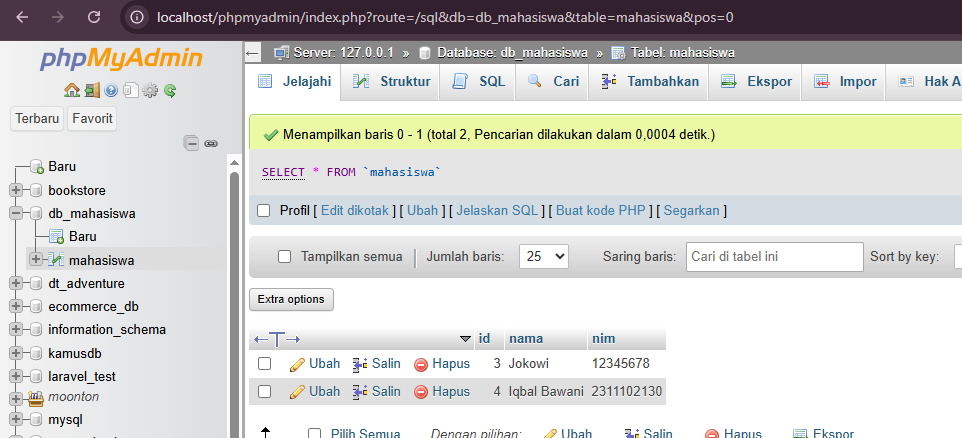
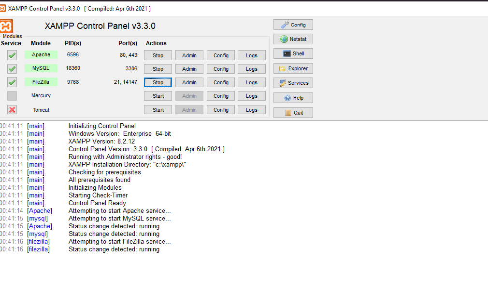
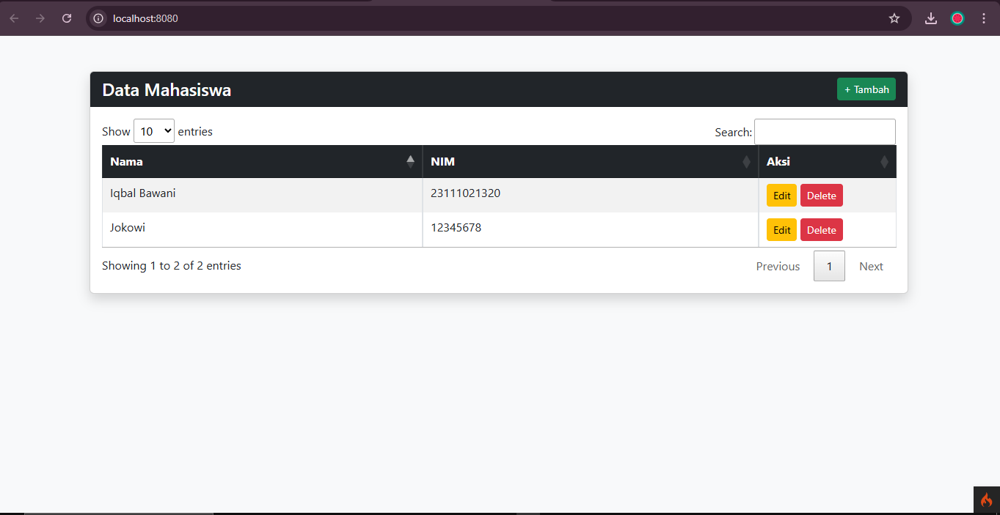
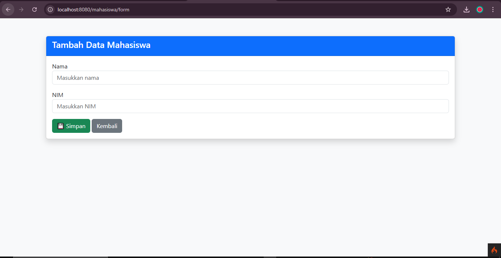
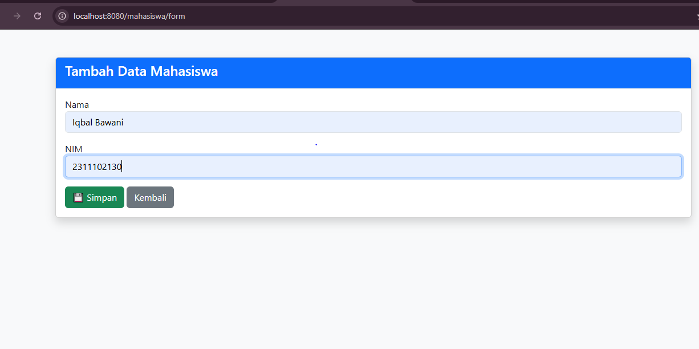
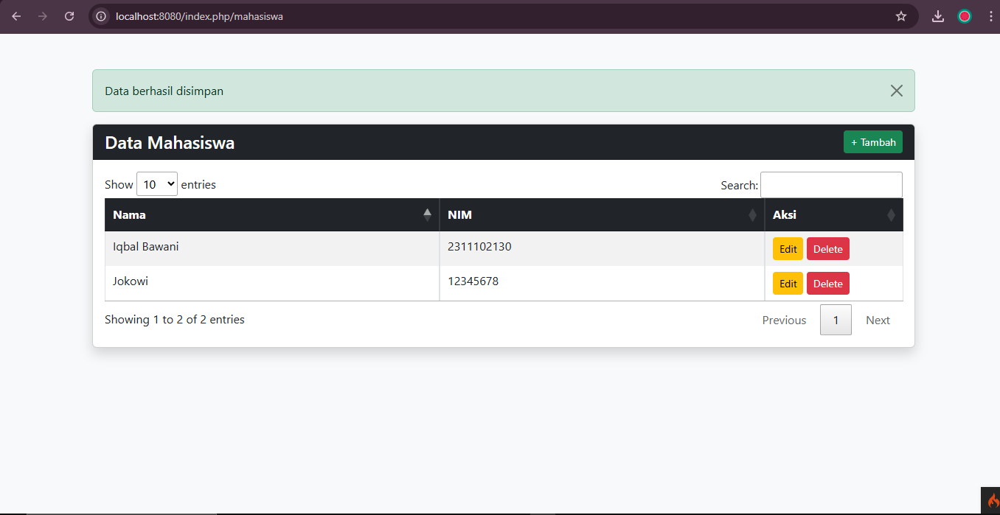
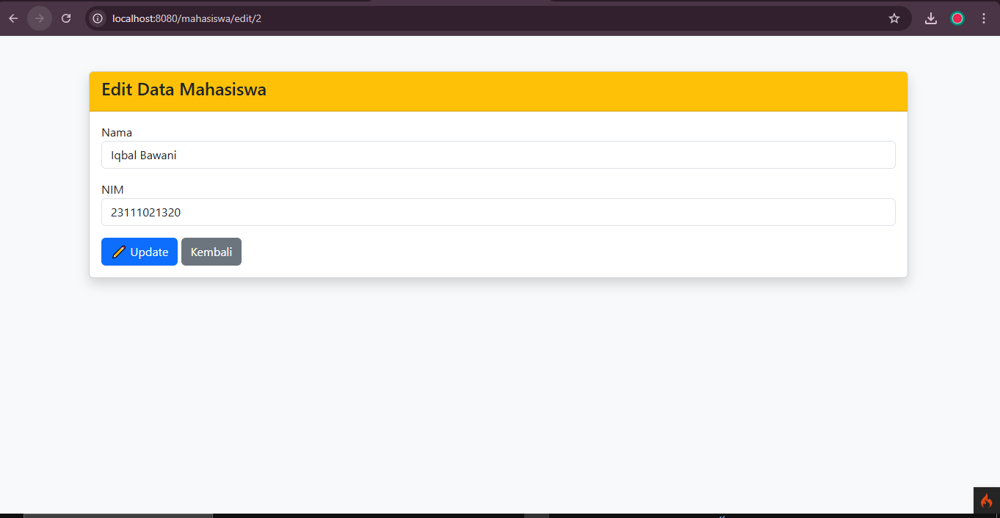
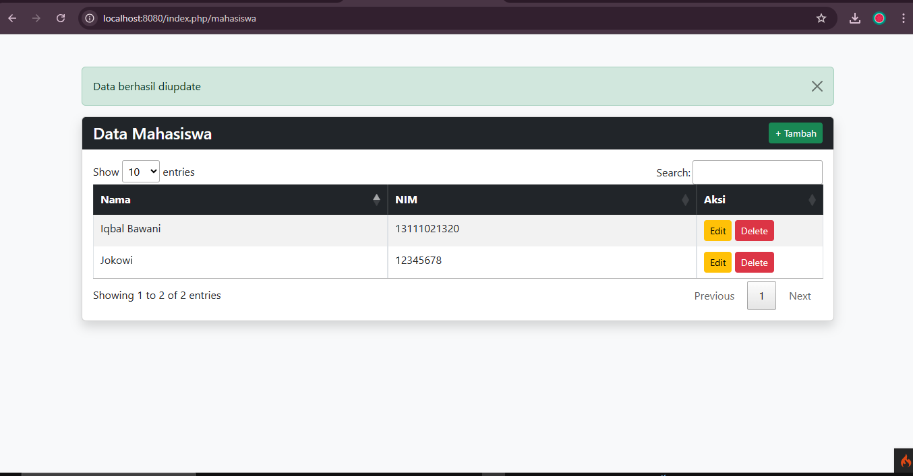
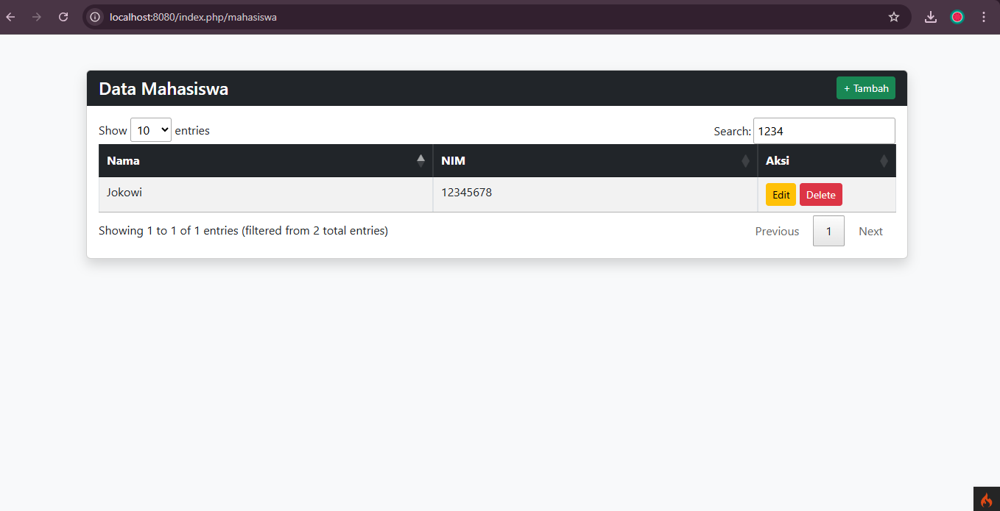
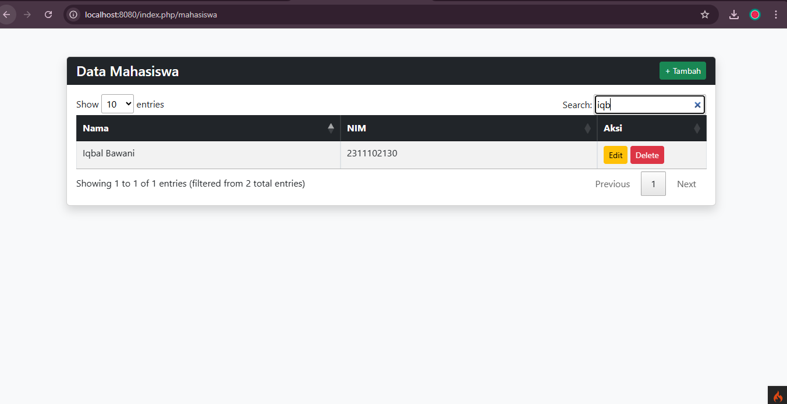

<div align="center">

# LAPORAN PRAKTIKUM

# APLIKASI CRUD DATA MAHASISWA

## CODING ON THE SPOTMANAJEMEN STOK

 

### Disusun Oleh

**Iqbal Bawani**
2311102130
IF-11-04

### Dosen Pengampu

**Cahyo Prihantoro, S.Kom., M.Eng.**

### LABORATORIUM HIGH PERFORMANCE

FAKULTAS INFORMATIKA
UNIVERSITAS TELKOM PURWOKERTO
2026

</div>

---

# Dasar Teori

## 1. Aplikasi Web

Aplikasi web adalah perangkat lunak yang berjalan pada server dan dapat diakses melalui browser menggunakan protokol HTTP/HTTPS. Aplikasi web terdiri dari dua bagian utama yaitu frontend (client-side) dan backend (server-side). Frontend bertugas menampilkan antarmuka kepada pengguna, sedangkan backend bertugas mengelola logika aplikasi dan database.


## 2. CodeIgniter

CodeIgniter adalah framework PHP berbasis MVC (Model-View-Controller) yang digunakan untuk membangun aplikasi web secara terstruktur. Dengan konsep MVC, aplikasi dipisahkan menjadi:

* Model → mengelola data
* View → tampilan
* Controller → logika aplikasi

Keunggulan CodeIgniter:

* Ringan dan cepat
* Mudah dipelajari
* Dokumentasi lengkap


## 3. Bootstrap

Bootstrap adalah framework CSS yang digunakan untuk membuat tampilan web yang responsif dan menarik. Bootstrap menyediakan komponen seperti tombol, form, tabel, dan grid system.


## 4. CRUD (Create, Read, Update, Delete)

CRUD adalah operasi dasar dalam pengolahan data:

* Create → menambah data
* Read → menampilkan data
* Update → mengubah data
* Delete → menghapus data


## 5. jQuery

jQuery adalah library JavaScript yang digunakan untuk mempermudah manipulasi DOM dan AJAX.


## 6. DataTables jQuery Plugin

DataTables adalah plugin jQuery yang digunakan untuk menampilkan data dalam bentuk tabel interaktif dengan fitur:

* Pencarian (search)
* Pengurutan (sorting)
* Pagination


## 7. JSON (JavaScript Object Notation)

JSON adalah format pertukaran data yang ringan dan digunakan dalam aplikasi ini untuk menampilkan data pada DataTables melalui AJAX.


## 8. MySQL sebagai Penyimpanan Data

MySQL adalah sistem manajemen basis data yang digunakan untuk menyimpan data mahasiswa. Data disimpan dalam tabel dan diakses melalui model pada CodeIgniter.

## Struktur Aplikasi

```bash
COTS/                       # Root direktori utama project
│
├── app/                    # Folder utama logika aplikasi (CodeIgniter)
│   ├── Config/             # Konfigurasi sistem
│   │   └── Routes.php      # Pengaturan routing URL
│   │
│   ├── Controllers/        # Controller (pengatur alur aplikasi)
│   │   └── Mahasiswa.php   # Mengelola request CRUD dan JSON DataTables
│   │
│   ├── Models/             # Model (akses database)
│   │   └── MahasiswaModel.php  # Query database tabel mahasiswa
│   │
│   └── Views/              # Tampilan (UI)
│       └── mahasiswa/      # Folder khusus fitur mahasiswa
│           ├── index.php   # Halaman utama (DataTables + JSON)
│           ├── form.php    # Halaman tambah data mahasiswa
│           └── edit.php    # Halaman edit data mahasiswa
├── .env                    # Konfigurasi database & environment
│
├── db_mahasiswa.sql           # File database MySQL (tabel mahasiswa)
│
└── README.md               # Dokumentasi project
```


## Keterangan Struktur

* **Config/Routes.php**
  Mengatur rute URL agar dapat mengakses controller dengan benar.

* **Controllers/Mahasiswa.php**
  Mengatur alur aplikasi, menerima request dari user, dan memproses CRUD.

* **Models/MahasiswaModel.php**
  Menghubungkan aplikasi dengan database MySQL dan menjalankan query.

* **Views/mahasiswa/**
  Berisi tampilan aplikasi:

  * `index.php` → halaman tabel DataTables
  * `form.php` → halaman tambah data
  * `edit.php` → halaman edit data

* **public/**
  Folder yang diakses oleh browser.

* **.env**
  Digunakan untuk konfigurasi koneksi database.

* **mahasiswa.sql**
  Berisi struktur tabel database yang digunakan dalam aplikasi.


## Cara Menjalankan Aplikasi

1. Buka folder project di VS Code

2. Jalankan server CodeIgniter:

```bash
php spark serve
```

3. Klik + CTRL atau Buka browser:

```bash
http://localhost:8080/mahasiswa
```


## Kode Program

### Controller (Mahasiswa.php)

```php
<?php

namespace App\Controllers;

use App\Models\MahasiswaModel;

class Mahasiswa extends BaseController
{
    protected $mhs;

    public function __construct()
    {
        $this->mhs = new MahasiswaModel();
    }

    public function index()
    {
        return view('mahasiswa/index');
    }

    public function getData()
    {
        return $this->response->setJSON([
            'data' => $this->mhs->findAll()
        ]);
    }

    public function form()
    {
        return view('mahasiswa/form');
    }

    public function save()
    {
        $this->mhs->save($this->request->getPost());

        return redirect()->to('/mahasiswa')
            ->with('success', 'Data berhasil disimpan');
    }

    public function edit($id)
    {
        return view('mahasiswa/edit', [
            'mhs' => $this->mhs->find($id)
        ]);
    }

    public function update($id)
    {
        $this->mhs->update($id, $this->request->getPost());

        return redirect()->to('/mahasiswa')
            ->with('success', 'Data berhasil diupdate');
    }

    public function delete($id)
    {
        $this->mhs->delete($id);

        return redirect()->to('/mahasiswa')
            ->with('success', 'Data berhasil dihapus');
    }
}

```
Penjelasan Singkat :

Mengatur proses CRUD dan pengambilan data JSON.

### Model (MahasiswaModel.php)
```php

<?php

namespace App\Models;

use CodeIgniter\Model;

class MahasiswaModel extends Model
{
    protected $table = 'mahasiswa';
    protected $primaryKey = 'id';
    protected $allowedFields = ['nama', 'nim'];
}
```
Penjelasan Singkat :

Mengelola database dan field yang digunakan.

### View

#### index.php
```php

<!DOCTYPE html>
<html>

<head>
    <title>Data Mahasiswa</title>

    <!-- Bootstrap -->
    <link rel="stylesheet" href="https://cdn.jsdelivr.net/npm/bootstrap@5.3.0/dist/css/bootstrap.min.css">

    <!-- DataTables -->
    <link rel="stylesheet" href="https://cdn.datatables.net/1.13.4/css/jquery.dataTables.min.css">
</head>

<body class="bg-light">

    <div class="container mt-5">

        <!--  NOTIFIKASI -->
        <?php if (session()->getFlashdata('success')): ?>
            <div class="alert alert-success alert-dismissible fade show" role="alert">
                <?= session()->getFlashdata('success'); ?>
                <button type="button" class="btn-close" data-bs-dismiss="alert"></button>
            </div>
        <?php endif; ?>

        <!-- CARD -->
        <div class="card shadow">
            <div class="card-header bg-dark text-white d-flex justify-content-between align-items-center">
                <h4 class="mb-0">Data Mahasiswa</h4>
                <a href="/mahasiswa/form" class="btn btn-success btn-sm">+ Tambah</a>
            </div>

            <div class="card-body">
                <table id="table" class="table table-bordered table-striped">
                    <thead class="table-dark">
                        <tr>
                            <th>Nama</th>
                            <th>NIM</th>
                            <th width="150">Aksi</th>
                        </tr>
                    </thead>
                </table>
            </div>
        </div>

    </div>

    <!-- jQuery -->
    <script src="https://code.jquery.com/jquery-3.6.0.min.js"></script>

    <!-- Bootstrap JS -->
    <script src="https://cdn.jsdelivr.net/npm/bootstrap@5.3.0/dist/js/bootstrap.bundle.min.js"></script>

    <!-- DataTables -->
    <script src="https://cdn.datatables.net/1.13.4/js/jquery.dataTables.min.js"></script>

    <script>
        $(document).ready(function() {
            $('#table').DataTable({
                ajax: '/mahasiswa/getData',
                columns: [{
                        data: 'nama'
                    },
                    {
                        data: 'nim'
                    },
                    {
                        data: 'id',
                        render: function(id) {
                            return `
                                <a href="/mahasiswa/edit/${id}" class="btn btn-warning btn-sm">Edit</a>
                                <a href="/mahasiswa/delete/${id}" 
                                   class="btn btn-danger btn-sm"
                                   onclick="return confirm('Yakin hapus data?')">
                                   Delete
                                </a>
                            `;
                        }
                    }
                ]
            });
        });
    </script>

</body>

</html>
```
Penjelasan Singkat :
Menampilkan halaman form, tabel, dan edit.

#### form.php
```php

<!DOCTYPE html>
<html>

<head>
    <title>Tambah Mahasiswa</title>

    <link rel="stylesheet" href="https://cdn.jsdelivr.net/npm/bootstrap@5.3.0/dist/css/bootstrap.min.css">
</head>

<body class="bg-light">

    <div class="container mt-5">
        <div class="card shadow">
            <div class="card-header bg-primary text-white">
                <h4>Tambah Data Mahasiswa</h4>
            </div>

            <div class="card-body">
                <form action="/mahasiswa/save" method="post">

                    <div class="mb-3">
                        <label>Nama</label>
                        <input type="text" name="nama" class="form-control" placeholder="Masukkan nama" required>
                    </div>

                    <div class="mb-3">
                        <label>NIM</label>
                        <input type="text" name="nim" class="form-control" placeholder="Masukkan NIM" required>
                    </div>

                    <button class="btn btn-success">💾 Simpan</button>
                    <a href="/mahasiswa" class="btn btn-secondary">Kembali</a>

                </form>
            </div>
        </div>
    </div>

</body>

</html>
```
Penjelasan Singkat :


#### edit.php
```php

<!DOCTYPE html>
<html>

<head>
    <title>Edit Mahasiswa</title>

    <link rel="stylesheet" href="https://cdn.jsdelivr.net/npm/bootstrap@5.3.0/dist/css/bootstrap.min.css">
</head>

<body class="bg-light">

    <div class="container mt-5">
        <div class="card shadow">
            <div class="card-header bg-warning text-dark">
                <h4>Edit Data Mahasiswa</h4>
            </div>

            <div class="card-body">
                <form action="/mahasiswa/update/<?= $mhs['id']; ?>" method="post">

                    <div class="mb-3">
                        <label>Nama</label>
                        <input type="text" name="nama" value="<?= $mhs['nama']; ?>" class="form-control" required>
                    </div>

                    <div class="mb-3">
                        <label>NIM</label>
                        <input type="text" name="nim" value="<?= $mhs['nim']; ?>" class="form-control" required>
                    </div>

                    <button class="btn btn-primary">✏️ Update</button>
                    <a href="/mahasiswa" class="btn btn-secondary">Kembali</a>

                </form>
            </div>
        </div>
    </div>

</body>

</html>
```
Penjelasan Singkat :


## Alur CRUD Aplikasi

### Create

User menginput data melalui form kemudian disimpan ke database.

### Read

Data ditampilkan menggunakan DataTables berbasis JSON.

### Update

User mengubah data melalui halaman edit.

### Delete

User menghapus data melalui tombol delete.


   
   


## Screenshot Website

1. Halaman Tabel Data
   

2. Halaman Tambah Data
   
   
   

3. Halaman Edit Data
   
   

4. Cari Data
   
   


## Kesimpulan

Aplikasi CRUD Data Mahasiswa berhasil dibuat menggunakan CodeIgniter dan telah memenuhi seluruh kriteria tugas, yaitu penggunaan Bootstrap, jQuery, DataTables, serta implementasi JSON.


## Referensi

1. https://codeigniter.com
2. https://getbootstrap.com
3. https://jquery.com
4. https://datatables.net


## Link Gdrive


